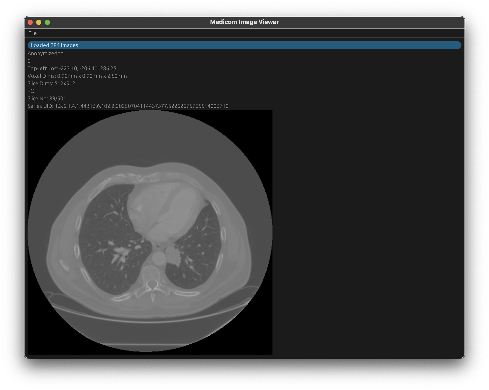
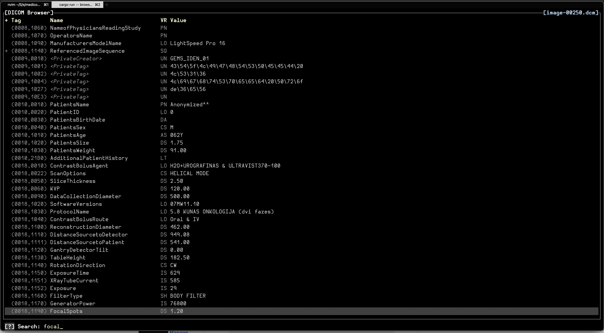

# medicom #

## About ##
The `medicom` library provides baseline functionality for managing DICOM,
including reading and writing DICOM files, decoding the PixelData element, and
the DIMSE network protocol (C-ECHO, C-FIND, C-STORE, C-MOVE, C-GET).

See the `medicom_tools` sub-crate for command-line utilities built to test out
the library.

```
$ medicom_tools view "..."
```



```
$ medicom_tools inspect "..."
```


## Quick Examples ##

### Parse through DICOM elements of a file.
```rust
// 1. Set up a parser for a DICOM file.
let parser: Parser<'_, File> = ParserBuilder::default()
    // Stops parsing once the PixelData element is seen to avoid loading it into
    // memory.
    .stop(TagStop::BeforeTagValue(&PixelData))
    // The dictionary is used during parsing for Implicit VR transfer syntaxes,
    // and associates the resolved VR to the resulting elements for parsing the
    // element values.
    .build(file, &STANDARD_DICOM_DICTIONARY);

// 2. Use the parser as an iterator over the elements.
for element_res in parser {
    let element = element_res?;
    // 3. Get a displayable name for the element, by looking it up in the
    //    dictionary or formatting the number as (GGGG,EEEE).
    let tag_name = STANDARD_DICOM_DICTIONARY.get_tag_by_number(elem.tag())
        .map(|tag| tag.ident().to_string())
        .unwrap_or_else(|| Tag::format_tag_to_display(elem.tag()));

    // 4. Parse/interpret the value of an element. The `parse_value()` funtion
    //    will parse as the explicit/implicit VR from the DICOM stream. Use
    //    `parse_value_as()` to parse the value as a different VR.
    //
    //    The `string()` function will attempt to interpret the parsed value as
    //    a single string, the first occurring string, returning `None` if
    //    inapplicable. There are variants for other common types for ease of
    //    parsing, `ushort()`, `int()`, etc.
    if let Some(tag_value) = element.parse_value()?.string() {
        println!("{tag_name}: {tag_value}");
    }

    // Refer to the `core::inspect` module for utilities to assist with
    // formatting DICOM element names and values.
}
```

### Decode PixelData for a DICOM SOP Instance, load into an `image::ImageBuffer`
```rust
// 1. Parse the DICOM file.
let parser: Parser<'_, File> = ParserBuidler::default()
    .build(file, &STANDARD_DICOM_DICTIONARY);

let Some(dcmroot) = DicomRoot::parse(&mut parser)? else {
    return Err(anyhow!("DICOM SOP is missing PixelData"));
};

// 2. Create an `ImageVolume` and load the DICOM file.
let mut imgvol = ImageVolume::default();
imgvol.load_slice(dcmroot)?;

let axis = VolAxis::Z;
let axis_dims = imgvol.axis_dims(&axis);
let win = imgvol
    .minmax_winlevel()
    .with_out(f32::from(u8::MIN), f32::from(u8::MAX));

// 3. Iterate through the pixels of a specific slice (0, only one slice in this example).
//    Use the Z / native axis. X or Y can be used for multi-planar reconstruction views.
let mut image: ImageBuffer<Rgb<u8>, Vec<u8>> =
    ImageBuffer::new(u32::try_from(axis_dims.x)?, u32::try_from(axis_dims.y)?);
for pix in imgvol.slice_iter(&axis, 0) {
    // Apply the `WindowLevel` which maps the range of values in the volume to the range of u8.
    #[allow(clippy::cast_possible_truncation)]
    let val = win.apply(pix.r) as u8;
    image.put_pixel(
        u32::try_from(pix.coord.x)?,
        u32::try_from(pix.coord.y)?,
        // For monochromatic the voxel value is used for R, G, and B.
        Rgb([val, val, val]),
    );
}
```

Refer to `medicom/readme.md` folder for further examples, and also the
`medicom_tools` sample applications.

## Design Goals ##
The APIs are not designed to encode the DICOM Information Object Definitions
within the type system. It will allow both reading and writing structures which
are valid DICOM binary protocol but it is up to the user of the API to ensure
that IODs are structured appropriately, i.e. that all necessary DICOM elements
are present and valid for a CT, MR, etc.

While this design puts the burden on the API user to interpret and create well-
formed DICOM structures, it grants greater flexibility, especially for working
with existing malformed DICOM datasets.

The DICOM standard dictionary of tags, UIDs, transfer syntaxes, etc. are
available as an optional feature of the crate. Reading and writing DICOM does
not require the DICOM standard dictionary and can be excluded to minimize the
resulting binary size if desired.

The core crate has minimal dependencies, two required and two optional.

- `encoding_rs` (required) for properly handling text encoding supported by
  DICOM.
- `thiserror` (required) for deriving errors.
- `phf` (optional) the DICOM standard dictionary components are encoded in a
  lookup map using perfect hash maps.
- `libflate` (optional) for reading and writing deflated datasets.

The API is also focused on enabling efficient operations:

- DICOM datasets are parsed in a stream-like manner allowing the API user to
  decide what is necessary to retain in-memory.
- DICOM element values themselves are not parsed during parsing of the dataset.
- Flexible options for limiting how much of a DICOM dataset to parse, e.g.
  stopping before the PixelData element if only metadata about the DICOM SOP is
  needed.
- DIMSE handling of DICOM dataset communication does not require the entire
  dataset to be loaded into memory at once.
- At the moment, decoding PixelData does require the entire element value to be
  loaded into meomry.

## Crates ##

- `medicom`: The core API for reading and writing DICOM, decoding images,and
optional support for the DICOM Message Exchange network protocol.
- `medicom_dict`: Parses the DICOM Standard XML files for producing the
  standard DICOM dictionary. This is intended to be used by `build.rs` scripts.
- `medicom_tools`: Example command-line tools using the `medicom` library. See
the `readme.md` within that folder for more information.

